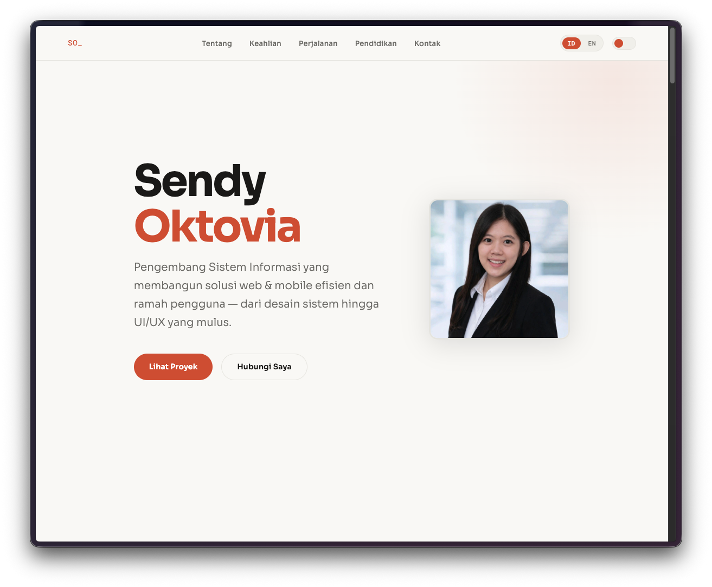
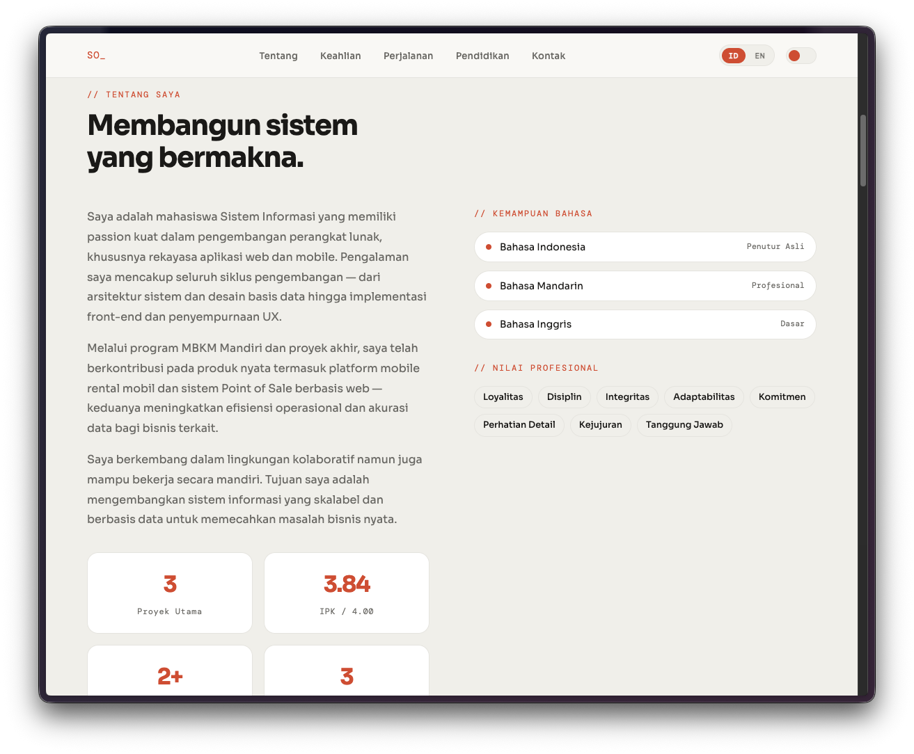
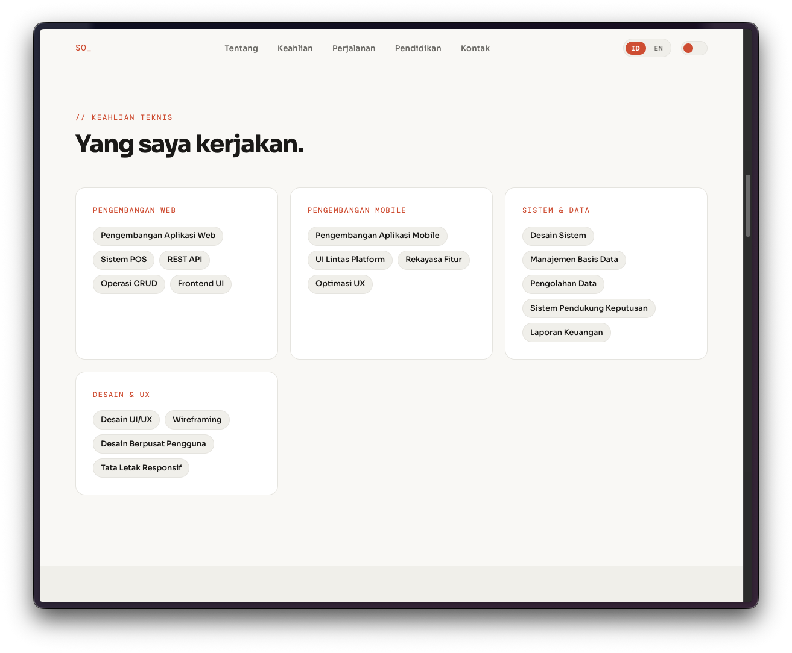
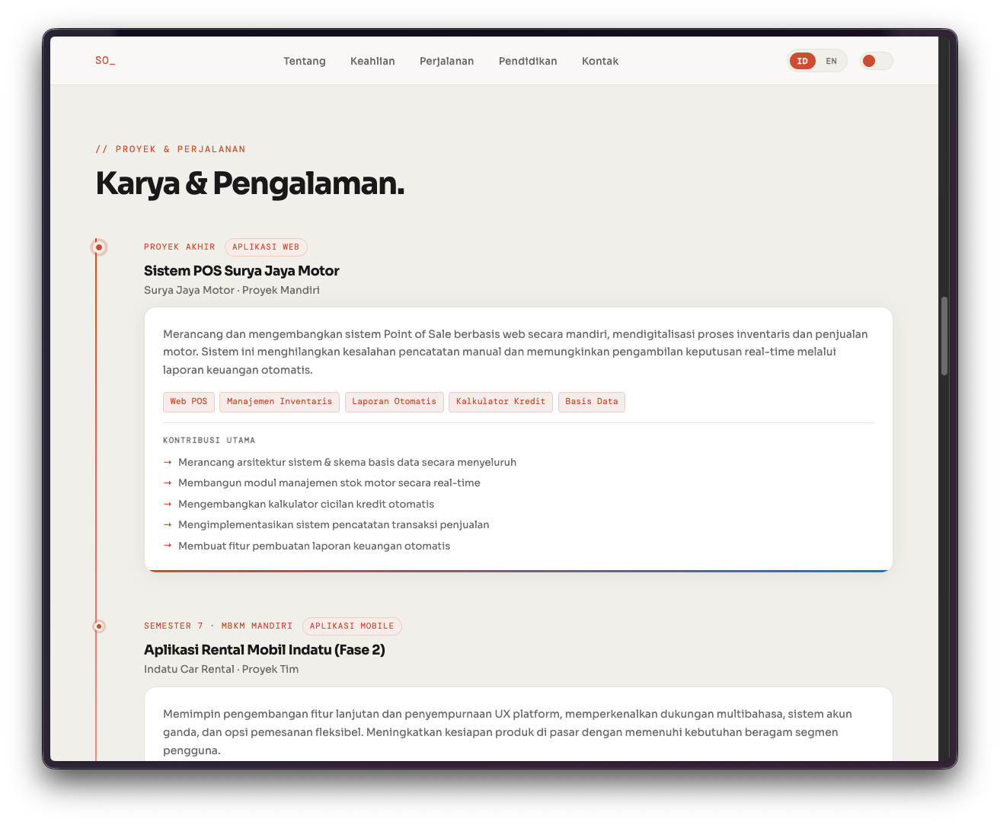

# Sendy Oktovia — Information System Developer Portfolio

A modern, immersive personal portfolio website showcasing projects, skills, and professional journey of an Information System Developer specializing in web and mobile application development.

---

## 📸 Screenshots

### Hero Section — First Impression

Professional introduction with name, tagline, and call-to-action buttons.



**Features:**

- Professional profile photo with rounded border
- Large, bold name with accent color highlighting
- Compelling tagline describing expertise
- Call-to-action buttons (primary and secondary)
- Navigation bar with language toggle and theme switcher
- Smooth animations on page load

### About Section — Professional Overview

Professional background with statistics, languages, and values.



**Features:**

- Introductory paragraphs about experience and goals
- Four statistics cards (Projects, GPA, Years Experience, Languages)
- Language proficiency list with skill indicators
- Professional values tags (Loyalty, Discipline, Integrity, etc.)
- Alternating background color for visual hierarchy

### Skills Section — Technical Expertise

Organized skill categories with descriptive tags.



**Skills Covered:**

- **Web Development** — REST APIs, POS Systems, CRUD, Frontend UI
- **Mobile Development** — Cross-platform UI, Feature Engineering, UX
- **Systems & Data** — System Design, Database Management, DSS
- **Design & UX** — UI/UX Design, Wireframing, Responsive Layouts
- Hover effects showing cards lifting with shadows

### Journey Section — Projects & Experience Timeline

Interactive vertical timeline showcasing major projects.



**Timeline Includes:**

- **3 Major Projects** with dates and type labels
- Project descriptions with business impact
- Technology stacks with styled tags
- Key contributions for each project
- Hover effects with gradient bottom accent
- Timeline dots and connecting gradient line

---

## 📝 Description

**Sendy Oktovia — Information System Developer Portfolio** is a sophisticated, modern personal portfolio website designed to showcase professional work, expertise, and achievements. Built entirely with vanilla HTML, CSS, and JavaScript, this single-page application demonstrates advanced frontend development skills while maintaining clean code architecture.

The portfolio serves as a living resume that highlights:

- **3 Major Projects** spanning web development, mobile apps, and system design
- **4 Professional Skill Categories** covering web, mobile, systems, and UX/design
- **Professional Background** with education, certifications, and work experience
- **Multilingual Support** for Indonesian and English-speaking audiences
- **Dark Mode** for enhanced user experience and accessibility

**Target Audience:** Tech recruiters, potential clients, and collaborators seeking to evaluate technical expertise and design sensibility.

**Key Value Propositions:**

- ✨ Modern, professionally designed interface
- 🌍 Bilingual experience (Indonesian/English)
- 🎨 Full dark/light theme support
- 📱 Fully responsive across all devices
- ♿ Accessibility-first design approach
- ⚡ Fast performance with minimal dependencies
- 🎭 Smooth animations and microinteractions

---

## 🛠️ Tech Stack

### Frontend Technologies

| Category       | Technology   | Purpose                                   |
| -------------- | ------------ | ----------------------------------------- |
| **Markup**     | HTML5        | Semantic structure, accessibility         |
| **Styling**    | CSS3         | Responsive design, animations, dark mode  |
| **JavaScript** | Vanilla JS   | Interactivity, language switching, modals |
| **Fonts**      | Google Fonts | Sora (sans-serif), DM Mono (monospace)    |

### Key CSS Features

- **CSS Grid & Flexbox** — Responsive layout system
- **CSS Custom Properties** — Dynamic theming
- **CSS Animations** — Smooth transitions and effects
- **Backdrop Filters** — Modern blur effects
- **Media Queries** — Mobile responsiveness
- **Color Mixing Functions** — Dynamic color adjustments

### JavaScript Capabilities

- **i18n Support** — Multi-language interface switching
- **Theme Persistence** — localStorage for user preferences
- **Intersection Observer** — Scroll-triggered animations
- **Modal Management** — Gallery modals for certificates
- **Mobile Menu** — Responsive navigation toggling

### Performance Characteristics

- **Bundle Size:** Single HTML file (~2000 lines with embedded CSS/JS)
- **Initial Load:** Instant (no build compilation needed)
- **Dependencies:** Zero production dependencies
- **Browser Support:** Modern browsers (Chrome 90+, Firefox 88+, Safari 14+, Edge 90+)

---

## 🚀 How to Run This Project

### Quick Start (No Setup Required)

Simply open the portfolio in your browser:

1. **Navigate to the project folder:**

   ```bash
   cd /path/to/sendy-information-system
   ```

2. **Open in browser:**

   ```bash
   # macOS
   open index.html

   # Windows
   start index.html

   # Linux
   xdg-open index.html
   ```

3. **Or manually:** Drag `index.html` into your web browser

### Development Setup

If you want to modify the portfolio or regenerate screenshots:

1. **Clone/navigate to the repository:**

   ```bash
   cd sendy-information-system
   ```

2. **Install dependencies:**

   ```bash
   npm install
   ```

3. **Edit the portfolio:**
   - Open `index.html` in your code editor
   - Modify HTML structure, CSS styles, or JavaScript functions
   - Save and refresh the browser to see changes

4. **Generate updated screenshots:**
   ```bash
   node capture-screenshots.js
   ```

### Local Development Server (Optional)

For better development experience, serve files with a local server:

```bash
# Using Python 3
python -m http.server 8000

# Using Node.js (if you have http-server installed)
npx http-server

# Using VS Code Live Server extension
# Install extension, then right-click index.html → "Open with Live Server"
```

Then visit: `http://localhost:8000`

### Features to Try

Once the portfolio is running:

1. **Navigation**
   - Click section links in the navigation bar
   - Scroll through all sections
   - Try the mobile menu on smaller screens

2. **Language Switching**
   - Click ID/EN toggle in top-right
   - All text updates in real-time

3. **Theme Toggle**
   - Click the moon/sun icon
   - Switch between light and dark modes
   - Preference is saved in browser

4. **Interactive Elements**
   - Hover over cards to see animations
   - Click on documentation images to view in modal
   - Scroll through certificate carousel

5. **Responsive Testing**
   - Resize browser window
   - Test on mobile devices
   - Use browser dev tools responsive mode

### System Requirements

- **Browser:** Any modern web browser (Chrome, Firefox, Safari, Edge)
- **For screenshot generation:** Node.js 14+ and npm
- **Code Editor:** VS Code, Sublime, or any text editor
- **OS:** Windows, macOS, or Linux

### Troubleshooting

**Blank page?**

- Make sure you're opening `index.html` directly or via a local server
- Check browser console for JavaScript errors (F12)

**Styles not loading?**

- Styles are embedded in the HTML, should load automatically
- Try hard refresh (Ctrl+Shift+R or Cmd+Shift+R)

**Language switcher not working?**

- Check that JavaScript is enabled
- Ensure you're not in a restrictive security mode

**Screenshots not generating?**

- Ensure Node.js is installed: `node --version`
- Install Puppeteer: `npm install puppeteer`
- Try: `node capture-screenshots.js`

---

## 🌟 Overview

This is a sophisticated, single-page portfolio application built with **vanilla HTML and CSS**, featuring:

- **Bilingual Interface** — Seamlessly switch between Indonesian and English
- **Dark Mode Support** — Full light/dark theme with smooth transitions
- **Responsive Design** — Optimized for desktop, tablet, and mobile devices
- **Smooth Animations** — Elegant fade-in and slide-up transitions throughout
- **Professional Layout** — Modular sections highlighting expertise and achievements
- **Interactive Elements** — Modal galleries, hover effects, and smooth scrolling navigation

**Live Preview Sections:**

- Hero introduction with call-to-action buttons
- Comprehensive about section with languages and professional values
- Technical skills organized by category
- Unified project & experience timeline
- Work documentation and portfolio gallery
- Achievements and certificates showcase
- Education history
- Interactive contact form
- Responsive navigation with mobile menu

---

## 📁 Project Structure

```
sendy-information-system/
├── index.html              # Main portfolio file (entire application)
├── README.md               # Project documentation
├── capture-screenshots.js  # Screenshot generation script
├── package.json            # NPM dependencies
├── package-lock.json       # Dependency lock file
└── assets/                 # Images and media
    ├── screenshot-hero.png         # Hero section screenshot
    ├── screenshot-about.png        # About section screenshot
    ├── screenshot-skills.png       # Skills section screenshot
    ├── screenshot-journey.png      # Journey section screenshot
    ├── certificate-*.jpeg          # 10 certificate images
    ├── cerfificate-*.jpeg          # Additional certificates
    └── dokumentasi-*.jpeg          # Work documentation (4 files)
```

---

## 🎨 Design System

### Color Palette

**Light Mode:**

- Background: `#f9f8f5` (warm cream)
- Surface: `#ffffff` (white)
- Accent: `#c8502a` (burnt orange)
- Text: `#1a1917` (dark brown)
- Text Muted: `#6b6a65` (gray)

**Dark Mode:**

- Background: `#111110` (near black)
- Surface: `#1f1e1c` (dark gray)
- Accent: `#e06840` (lighter orange)
- Text: `#f0efe9` (off-white)
- Text Muted: `#8a8880` (light gray)

### Typography

- **Sans-serif Font:** Sora (for main content) — weights: 300, 400, 500, 600, 700
- **Mono Font:** DM Mono (for labels & technical details) — weights: 300, 400, 500
- **Border Radius:** 16px (default), adaptable for different components
- **Transitions:** 0.3s cubic-bezier(0.4, 0, 0.2, 1)

### Spacing & Sizing

Uses CSS `clamp()` for responsive sizing:

- Section padding: `clamp(4rem, 10vw, 8rem)`
- Horizontal padding: `clamp(1.5rem, 5vw, 4rem)`
- Font sizes adapt fluidly with viewport width
- Maintains consistent proportions across all screen sizes

---

## 🚀 Key Features

### 1. **Language Switching**

- Indonesian (ID) and English (EN) support
- Language preferences stored via `setLang()` function
- All text uses i18n attributes (`data-i18n`) for easy translation
- Language toggle in navigation bar

### 2. **Theme Toggle**

- Light/dark mode switcher with animated toggle button
- Persists user preference
- Smooth transition animations between themes
- Uses CSS custom properties for dynamic theming

### 3. **Navigation System**

- Fixed sticky navigation with blur backdrop effect
- Mobile hamburger menu that slides down on smaller screens
- Smooth scroll behavior to sections
- Active language indicator

### 4. **Sections Overview**

| Section           | Purpose                   | Content                                        |
| ----------------- | ------------------------- | ---------------------------------------------- |
| **Hero**          | First impression          | Name, tagline, call-to-action buttons, photo   |
| **About**         | Professional introduction | Background, statistics, languages, values      |
| **Skills**        | Technical expertise       | Web dev, mobile dev, systems, design/UX        |
| **Journey**       | Projects & experience     | Timeline of major work (3 projects shown)      |
| **Documentation** | Visual portfolio          | 4 work documentation images with modal gallery |
| **Achievements**  | Recognition               | 10 certificates in carousel (scrollable)       |
| **Education**     | Academic background       | Degree info with GPA, year, and badges         |
| **Contact**       | Engagement                | Contact info, social links, inquiry form       |

### 5. **Interactive Elements**

**Journey Timeline:**

- Vertical timeline with colored dots and gradient line
- Project cards with hover effects and bottom gradient accent
- Contribution lists with arrow indicators
- Tech stack tags for each project

**Certificate Gallery:**

- Horizontal scrolling carousel (touch-friendly)
- Modal popup on click to view full-size image
- Close button with animated icon rotation
- Smooth backdrop blur effect

**Form Components:**

- Labeled text inputs and textarea
- Focus states with accent border and shadow
- Full-width responsive layout

---

## 🛠️ Technical Details

### HTML Structure

The entire portfolio is a single `index.html` file with:

- Semantic HTML5 structure (`<section>`, `<article>`, `<nav>`)
- Embedded CSS (2000+ lines of responsive styling)
- Inline JavaScript for interactivity
- i18n data attributes for multi-language support

### CSS Features Used

- **CSS Custom Properties** (CSS Variables) for theming
- **CSS Grid & Flexbox** for responsive layouts
- **Gradient backgrounds** for visual depth
- **Backdrop filters** for modern blur effects
- **CSS animations** (`@keyframes fadeSlideUp`, `slideUp`)
- **Media queries** for mobile responsiveness (`max-width: 768px`, `480px`)
- **Color mixing** functions for dynamic color adjustments
- **Transform animations** for hover and interaction states

### JavaScript Functions

Key interactive functions:

- `setLang(lang)` — Switch between Indonesian and English
- `closeMobile()` — Close mobile menu
- `openCertModal(src, title)` — Display certificate in full-screen modal
- `closeCertModal()` — Close certificate modal
- Intersection Observer for fade-in animations on scroll
- Theme persistence using localStorage

---

## 📱 Responsive Breakpoints

The design adapts at:

- **768px and below:** Tablet/mobile layout
  - Navigation links hide, hamburger menu appears
  - Grid layouts switch to single column
  - Certificate grid becomes 2 columns
  - Education cards stack vertically
- **480px and below:** Small mobile
  - Certificate grid becomes 1 column
  - Stat row maintains 2 columns for density

---

## 🎯 Portfolio Highlights

### Featured Projects

1. **SJM Pos System** (Final Year Project)
   - Web-based Point of Sale system
   - Real-time inventory management
   - Automated financial reporting
   - Credit calculator functionality

2. **Indatu Car Rental App - Phase 2**
   - Mobile rental platform (advanced)
   - Multi-language support
   - Dual account system (personal/business)
   - Enhanced UX and flexible booking options

3. **Indatu Car Rental App - Phase 1**
   - Initial mobile rental platform
   - DSS-based vehicle recommendations
   - Secure authentication
   - Core booking workflow

### Skills Categories

- **Web Development:** REST APIs, POS systems, CRUD operations, frontend UI
- **Mobile Development:** Cross-platform UI, feature engineering, UX optimization
- **Systems & Data:** System design, database management, data processing, DSS
- **Design & UX:** UI/UX design, wireframing, user-centered design, responsive layouts

### Professional Values

Loyalty • Discipline • Integrity • Adaptability • Commitment • Attention to Detail • Honesty • Responsibility

---

## 📸 Assets Included

**Screenshots:** 4 high-quality PNG screenshots showcasing key portfolio sections (Hero, About, Skills, Journey)

**Certificates:** 10 professional certifications showcasing continuous learning

**Documentation:** 4 portfolio pieces demonstrating work quality and project scope

All images are optimized for web display and included in the `assets/` folder.

---

## 🎭 Animation & Microinteractions

The portfolio features sophisticated animations:

- **Fade-in on Scroll:** Elements fade and slide up when they come into view
- **Hover Effects:** Cards lift with shadow enhancement on hover
- **Bottom Accent Animation:** Gradient line animates left-to-right on hover
- **Theme Toggle:** Smooth sliding toggle button indicator
- **Modal Transitions:** Slide-up animation for certificate modals
- **Button States:** Lift and shadow effects on hover with smooth transitions

---

## 🔧 Customization Guide

### Regenerate Screenshots

Screenshots are automatically captured at different scroll positions. To regenerate them after making design changes:

```bash
node capture-screenshots.js
```

This will:

1. Launch a browser instance via Puppeteer
2. Load the portfolio
3. Scroll to each section
4. Capture and save PNG images
5. Save to `assets/screenshot-*.png`

**Requirements:** Node.js and npm (already included in package.json)

### Change Color Theme

Edit the `:root` CSS variables in the `<style>` section:

```css
:root {
  --bg: #f9f8f5; /* Background color */
  --accent: #c8502a; /* Primary accent color */
  --accent2: #2a6bc8; /* Secondary accent color */
  /* ... more variables ... */
}
```

### Update Content

All text content uses `data-i18n` attributes for easy translation. Update text directly in the HTML or modify the JavaScript translation system.

### Add New Projects

Duplicate a `.journey-item` element in the Journey section and update:

- Date and type
- Project title and organization
- Description
- Tech stack tags
- Contribution list items

### Add Certificates

Add new images to `assets/` folder and create new carousel items or documentation cards.

---

## 🌐 Browser Support

Works on all modern browsers:

- Chrome/Chromium 90+
- Firefox 88+
- Safari 14+
- Edge 90+

---

## 📝 i18n Structure

The portfolio supports two languages through data attributes:

**Indonesian (ID):** Default language with comprehensive translations
**English (EN):** Full English translations for all interface text

Each text element has a `data-i18n` key that maps to translation strings. Add new keys following the existing naming convention.

---

## 🎓 Learning Insights

This portfolio demonstrates proficiency in:

- **HTML5 semantic structure** for accessibility and SEO
- **Advanced CSS** including variables, grid, flexbox, and animations
- **Responsive design** principles and mobile-first thinking
- **UX/UI design** with attention to visual hierarchy and interaction feedback
- **Internationalization** for multi-language support
- **Dark mode implementation** for modern user experiences
- **Accessibility considerations** with ARIA labels and semantic HTML

---

## 📧 Contact & Information

The portfolio includes:

- Professional links and social profiles
- Contact form for inquiries
- Email contact information
- Language (Indonesian, Mandarin Chinese, English)
- Education from recognized institutions
- Professional certifications and achievements

---

## 🚀 Getting Started

1. **Open the Portfolio:** Simply open `index.html` in a web browser
2. **Explore Sections:** Navigate using the top navigation menu or scroll
3. **Switch Languages:** Use the ID/EN toggle in the navigation bar
4. **Toggle Theme:** Click the theme toggle button to switch between light/dark modes
5. **View Gallery:** Click on documentation images to view in full-screen modal
6. **Browse Certificates:** Scroll horizontally through the certificate carousel

---

## 💡 Design Philosophy

This portfolio embodies:

- **Minimalism:** Clean, uncluttered design focused on content
- **Elegance:** Sophisticated typography and subtle animations
- **Accessibility:** Clear hierarchy, readable fonts, sufficient contrast
- **Responsiveness:** Adapts gracefully to any screen size
- **Performance:** Vanilla HTML/CSS with minimal JavaScript
- **Professionalism:** Modern design that reflects technical expertise

---

## 📜 License

This portfolio is the personal work of Sendy Oktovia. All rights reserved.

---

**Last Updated:** May 2026  
**Built with:** HTML5 • CSS3 • Vanilla JavaScript  
**Design Approach:** Mobile-first, responsive, accessible, performant
